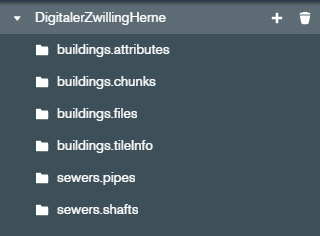

# Digital Twin Herne <!-- omit in toc -->

**Table of Content**
- [Overview](#overview)
- [Components](#components)
- [Installation](#installation)
- [Data Location](#data-location)
- [Contributing Organizations and Contact](#contributing-organizations-and-contact)
  - [Additional Contributors](#additional-contributors)
- [License](#license)

## Overview
A prototypical implementation of a Digital Twin for the city of Herne in Germany, focusing on the underground structural infrastructure. It was created in cooperation with the Bochum University of Applied Sciences and was initially based on a master's thesis. The project's goals are:

- Support the city of Herne on it's way to a Smart City.
- Provide an application, that can visualize heterogeneous data from different city departments in combination 
- Visualize the city's (underground) sensor infrastructure.
- Gain practical experience in the field of digital twins.

## Components
The project is divided into multiple sub-repositories. This repository serves as an entry point.

<!-- TODO provide an architecture overview diagram here -->

- ### [Frontend](https://github.com/t16h05008/DT-Herne-Frontend)
    Contains the Cesium web viewer.

- ### [Backend](https://github.com/t16h05008/DT-Herne-Backend)
    Contains the Node.js backend server.

- ### [Database](https://github.com/t16h05008/DT-Herne-Database)
    Doesn't contain the actual database. It serves as a place where users can temporarily store the data, that should be imported into the database during the build processs.

- ### [Data Management](https://github.com/t16h05008/DT-Herne-Data-Management)
    Contains Tools and scripts for data management, preparation and conversion.

## Installation
The recommended way is to use Docker.

1. Clone this repository to your local machine. 
2. Run the command `git submodule update --init` to download the submodules.
3. Navigate into the folders `DT-Herne-Frontend`, `DT-Herne-Backend` and `DT-Data-Management` and install the dependencies with `npm install` (or `npm ci`).
4. Run the command `npm run build` in the frontend submodule. This bundles the client into the directory `DT-Herne-Frontend/dist`.
5. Component-specific installtion instructions
   - The frontend includes some of the standard Cesium ion maps and terrain.    These are only accessible with an API-token. It can be generated for free with an [Cesium ion account](https://cesium.com/ion/signup/). Insert that token in the file `.env` in the submodule. The .env file also contains the URL to the backend. By default it is set to `http://localhost:8000/`. If the backend runs on a different server or port, this has to be adjusted accordingly.
   <!--- Configuration of the backend is done in the file [docker-compose.yml](docker-compose.yml). Here you can set the name of the MongoDB database. While this name doesn't matter that much (it is only used internally), it is needed in the next step.-->
   - **TODO** Data locations
6. With all prparations done the last step is to run the commands `docker compose build` and `docker compose up -d` from the root directory.

## Data Location
There are two data locations. Depending on the API endpoint / data type, data is stored either in a mongodb instance or in a subdirectory on the backend server itself. While the database name is variable, the collection names are still hardcoded. The database used for development looks like this:

Since the mongodb runs in a docker container, data needs to be imported into the docker image. See the databse submodule for details. (TODO)

The [Data Management sub-repository](https://github.com/t16h05008/DT-Herne-Data-Management) offers scripts and tools to create the shown collections. In most cases, these are tailored to the data provided by the city of Herne and might not work for your own data. But as long as the collections exist, the application will start.

For some endpoints, namely the pointcloud and the terrain tiles, data is stored in the subdirectory `data` in the backend submodule (doesn't exist by default). There might be a way to store a folder-structure in mongodb, but for now the backend is partially used as a file-server. The pointcloud is expected to be in the subdirectory `/data/metroPc` and the terrain tiles in the subdirectories `data/terrain1`, `data/terrain10`, `data/terrain25` and `data/terrain50`, where 1, 10, 25, and 50 stand for the resolution (which is an api query parameter). Again, refer to the [Data Management sub-repository](https://github.com/t16h05008/DT-Herne-Data-Management) to see how these files are created.

## Contributing Organizations and Contact
<table>
    <thead>
        <tr>
            <th>Organization</th>
            <th>Contact Person</th>
            <th>Role</th>
            <th>E-Mail</th>
        </tr>
    </thead>
    <tbody>
        <tr>
            <td rowspan=2><a href="https://www.herne.de/">City of Herne</a></td>
            <td>Anja Sigesmund</td>
            <td>Project Manager / Organizer</td>
            <td>anja.sigesmund@herne.de</td>
        </tr>
        <tr>
            <td>Heinz Hasse</td>
            <td>Project Manager / Organizer</td>
            <td>heinz.hasse@herne.de</td>
        </tr>
        <tr>
            <td rowspan=2><a href="https://www.hochschule-bochum.de/">Bochum University of Applied Sciences</a></td>
            <td>Benno Schmidt</td>
            <td>Project Manager / Organizer</td>
            <td>benno.schmidt@hs-bochum.de</td>
        </tr>
        <tr>
            <td>Tim Herker</td>
            <td>Developer</td>
            <td>tim.herker@stud.hs-bochum.de</td>
        </tr>
    </tbody>
</table>

### Additional Contributors
- [City of Herne, Department for Cadaster and Geoinformation](https://www.herne.de/Rathaus/Buergerservice/Die-Stadtverwaltung-im-Ueberblick/Fachbereich-Vermessung-und-Kataster/)
- [Stadtentwässerung Herne](https://www.se-herne.de/)

## License
Released under the [MIT License](https://github.com/t16h05008/DT-Herne/blob/master/LICENSE).